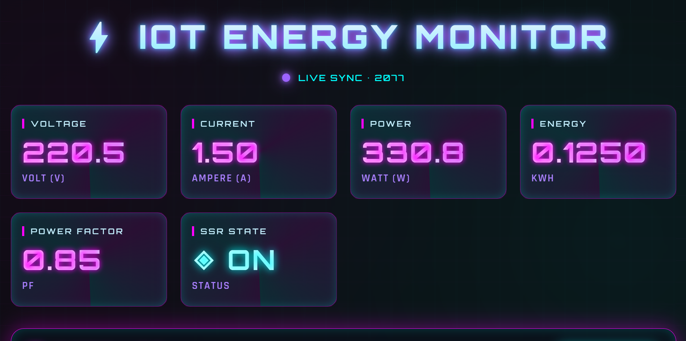
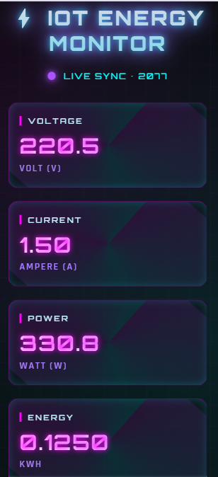
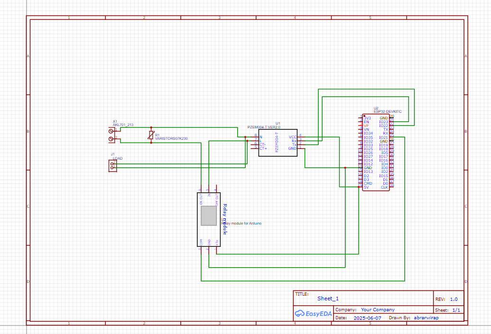

# ESP32 PZEM-004T Energy Monitor with SSR Control

Sistem monitoring listrik real-time berbasis ESP32 dengan sensor PZEM-004T v3.0, LCD 16x2 I2C, dan kontrol SSR. Data listrik ditampilkan secara langsung dan dikirim ke server backend melalui HTTP dengan sistem pengiriman data yang efisien (hanya saat ada perubahan).


---

## 📸 Screenshots

### Dashboard Monitoring
| Desktop | Mobile |
|---------|--------|
|  |  |

### Wiring Diagram



### 🔧 Fitur Sistem
- **Real-time Monitoring**: Update data setiap 1 detik
- **Smart Data Transmission**: Kirim data hanya saat ada perubahan (efisien bandwidth)
- **Automatic Page Switching**: Berganti halaman setiap 20 detik
- **Connection Indicator**: "ON" muncul hanya saat berhasil kirim ke server
- **Over-Current Protection**: Otomatis matikan SSR jika arus > 9.9A
- **Remote SSR Control**: Kontrol SSR melalui backend
- **Error Handling**: Debugging via Serial Monitor

---

## 🛠️ Komponen yang Dibutuhkan

| Komponen | Jumlah | Keterangan |
|----------|--------|------------|
| ESP32 Development Board | 1 | NodeMCU-32S atau varian lainnya |
| PZEM-004T v3.0 | 1 | Sensor energi listrik |
| LCD 16x2 I2C | 1 | Display dengan alamat I2C 0x27 |
| SSR (Solid State Relay) | 1 | Untuk kontrol beban AC |
| Power Supply 5V | 1 | Untuk ESP32 dan LCD |
| Kabel Jumper | Secukupnya | Koneksi antar komponen |

---

## 🔌 Wiring Diagram

| ESP32 Pin | Komponen | Pin Komponen | Keterangan |
|-----------|----------|--------------|------------|
| GPIO 22 | PZEM-004T | TX | UART RX |
| GPIO 23 | PZEM-004T | RX | UART TX |
| GPIO 19 (SDA) | LCD I2C | SDA | Data I2C |
| GPIO 18 (SCL) | LCD I2C | SCL | Clock I2C |
| GPIO 12 | SSR | Signal Input | Kontrol SSR (HIGH=ON) |
| 5V | PZEM-004T, LCD | VCC | Power 5V |
| GND | PZEM-004T, LCD | GND | Ground |

> **⚠️ Catatan Penting:**
> - PZEM-004T membutuhkan power supply 5V terpisah
> - Gunakan kabel yang cukup untuk daya (minimal 22 AWG)
> - Pastikan polaritas terhubung dengan benar

---

## 📦 Library yang Dibutuhkan

Install melalui Arduino Library Manager:

```cpp
#include <WiFi.h>              // Bawaan ESP32
#include <HTTPClient.h>         // Bawaan ESP32
#include <Wire.h>              // Bawaan ESP32
#include <LiquidCrystal_I2C.h>  // Library LCD I2C
#include <PZEM004Tv30.h>        // Library PZEM-004T